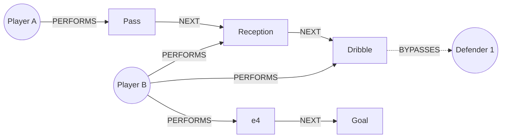
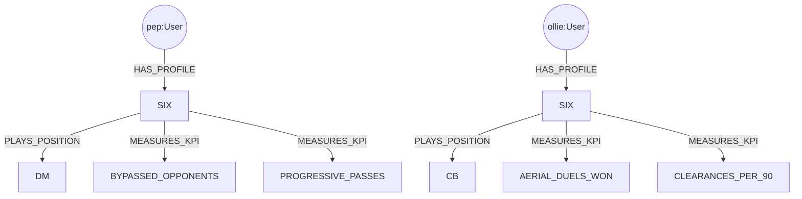
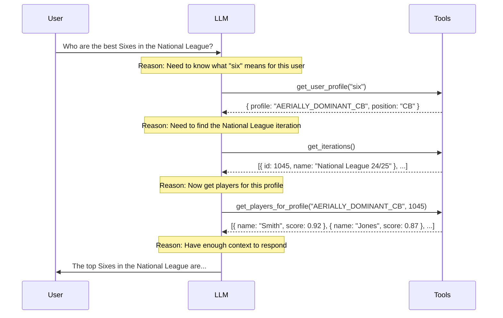

<!--
Original Notes:

Opening:
When I started preparing and submitting talks, I thought this post would be about solving what I think is the ultimate problem to solve, winning games of football. But really, it's a story about making sense of data, translating statistics into natural language, and providing an interface for anyone to...

Talking points:
- There is a disconnect between the data providers and the ultimate person who can action the data. See https://www.bbc.co.uk/sport/football/articles/c781v7zz0w2o - tony pulis (who i have a lot of respect for) is talking about not using data, but then goes on to mention the Rothman's book, which is data. It's just stored and accessed differently these days.

- Even then, there's a translation problem. A "british six" like Harry Maguire is completely different to a "european six" like Busquets (who ironically wore the number 5).

- Example: "I want a six with legs who can put it about a bit" - what does that mean?

- Disconnect between the analyst who walks and talks like an athletic tactics piece with a manager who doesn't know how to turn on his phone, let alone analyse the data in excel

- The role of graphs - advanced sounding metrics are only aggregations of a single event type, not a chain of events.

- Access to the raw data alone via MCP

- Claude skills for visualising the data
-->

When I started preparing talks on this topic, I thought it would be about winning games of football.

But in reality, it's more a story about making sense of data, translating statistics into natural language, and providing an interface that allows anyone to access the data.


## The Analyst-Manager Divide

In every industry, executives with deep knowledge of their business sit across from data analysts presenting dashboards they can't interpret.  In the time it takes to produce a new report, the decision the report should be influencing has already been made on gut feel alone.

Football is no exception.  Imagine analyst who walks and talks like [a tactics piece from The Athletic](https://www.nytimes.com/athletic/podcast/145-football-tactics-podcast/), talking about xG (_Expected Goals_ - the probability of an individual shot being scored) or PPDA (_Passes per defensive action_) with an ex-professional footballer turned manager who struggles to turn on their phone, let alone hold statistical models in their head.

The two may as well be talking different languages.

The manager is well within his rights to reply back with _"only one stat matters -- that's goals"_.


### Lost in Translation


<div class="float-right ml-2 w-64 md:-mt-12">

</div>


In a recent article, [Tony Pulis talked about his recruitment process](https://www.bbc.co.uk/sport/football/articles/c781v7zz0w2o), and how his database was _"in [his] own head"_.  Almost immediately, he followed this by saying he'd get appearances and goals from the [Rothmans Football Yearbook](https://en.wikipedia.org/wiki/The_Football_Yearbook).

One of the comments summed it up nicely: _"Yeah that book full of you know .. DATA."_

For the most part, we're still looking at the same data and measures of success, but it's now stored and accessed in different ways. It's just a different skillset, with different ways of working with information.

Ian Holloway, the manager of my hometown club Swindon Town, [has also recently had his say](https://x.com/BBCWiltsSport/status/1994049679407948263) on the current state of analysis.

> If you want to be a coach, then go and take your badges and you'll hear all sorts of nonsense spoken these days about "provoke the press", and "two sixes", and... "two eights and one six", and "two tens".  It's all complete nonsense, in my opinion.

There's an experienced manager with over 1000 games under his belt, who has taken Swindon Town from the bottom to the top of League Two in 9 months, and clearly knows how to win football games, who this data is designed to help.

His exasperated advice:

> Just ask ChatGPT.


## Just ask ChatGPT (Or Claude, maybe)?

This topic has been on my mind for some time.

My role at Neo4j is to use generative AI and knowledge graphs to teach developers and data scientists about [knowledge graphs and generative AI](https://graphacademy.neo4j.com/knowledge-graph-rag/?ref=adam).  I've always looked for opportunities to [apply graph thinking to football analytics](/posts/analysing-football-events-neo4j/), and this is no exception.

### The problem with LLMs

Large Language Models (LLMs), like the GPT series that power ChatGTP, are powerful, highly useful, next word predictors.  They use patterns identified in large corpus of text to predict the next word in a sequence based on an input.

When you _prompt_ an LLM, or provide it with instructions, you're narrowing down the search space and the possibilities.

An LLM has no knowledge of what it has generated.

This, coupled with lack of access to real-time data cause the models to [Hallucinate](https://en.wikipedia.org/wiki/Hallucination_(artificial_intelligence)), or present false and misleading information as fact.

Some call this a feature, but in industries where accuracy is paramount, this is a real problem.


### Solving the hallucination problem

A technique called **Retrieval Augmented Generation** (RAG) surfaced in 2023 to address the hallucination problem.  RAG is an all encompassing term for improving the LLM generated responses (_augmenting_) by _retrieving_ data from additional data sources.

You don't use the LLM for it's _knowledge_, you instead use it for it's language generation skills.

As models are fine tuned for _reasoning_, breaking down large tasks into smaller logical steps, the term **Context engineering** has emerged.  RAG's rigid retrieve-then-generate pipeline struggles with complex queries that need multiple retrieval steps or different types of information.

The **ReAct** pattern (Reason + Act) takes a different approach: the LLM reasons about what it needs, calls a tool, observes the result, and repeats until it has enough context to respond.  Instead of one big retrieval upfront, context is built incrementally through a loop.

If we can provide an LLM with access to up-to-date football event data, how will it fare as a football analyst?

### Graphs and football

Football data providers group their data into two categories:

* **event data** - on-ball events; passes, shots, interceptions, etc.
* **tracking data** - precise, GPS-powered locations captured multiple times a second.

While tracking data is useful in many contexts, for example identifying physical load for sport science, it seems rarely available for opposition analysis, and will most likely present more noise than signal.

Event data provides a more aggregated view and highlight the key actions in the game, which is useful for both opposition analysis and player recruitment.

The volume of data makes a database necessary. A single match has upwards of 3 000 events, which is 2.8 million events per season.

As the event data is a sequence of interconnected actions, a graph database is a good place to store it.

Even the most advanced metrics spoken about today are aggregations of single actions, which seems to me like symptom of the limitations of the underlying data storage.

Storing the data in a graph provides additional context around each event — what happened before, what happened after, which players were involved?  Was the ball with the goalkeeper within 5 passes?



You can read more about [analysing football events in a graph database](/posts/analysing-football-events-neo4j) in my previous post.

If we give an LLM access to this graph-structured event data, it should be able to answer questions about sequences and patterns that traditional metrics miss.


## Accessing real-time data with MCP

2025 is the "_year of the agent_", a quote claimed by many.

Since the release of GPT 3.5 and ChatGPT, models have been increasingly fine-tuned to perform actions like selecting tools from a list, and providing consistent structured outputs. Reliable structured outputs have enabled us to build software that uses the underlying models to perform agentic workflows.

The most common pattern for agents is **ReAct**—where an LLM-backed application (often referred to as a _runner_) **reasons** about the problem at hand, and **acts** by calling tools.  Tools are simply functions, with a unique name and description.

[Model Context Protocol (MCP)](https://modelcontextprotocol.io/docs/getting-started/intro) is a standard first introduced by [Anthropic](https://www.anthropic.com/) in November 2024.  The standard provides a universal way to define tools, resources and other artifacts that can be used by agents.  At the same time, two SDKs were released for Python and TypeScript.

The release led to a lot of hype, and hundreds if not thousands of hastily thrown together MCP servers for many popular tools.


I have a custom MCP server written in python to expose the [latest Neo4j Documentation](https://neo4j.com/docs), which **Cursor** uses to fact-check the claims made in lessons on [GraphAcademy](https://graphacademy.neo4j.com/?ref=adam).


<!-- The specification consists of:

* **Servers** - Similar to miroservices, a service provides capabilities through a list of tools
* **Clients** - Manages one-to-one connections between servers and the applications that consume them.
- **Hosts** - An application that maintains state and context, using clients to connect to servers - Claude Desktop and Cursor are good examples of a host. -->


The MCP specification is fast evolving, so [I recommend bookmarking modelcontextprotocol.io](https://modelcontextprotocol.io/).


## Using existing MCP servers

MCP allows companies to provide a set of tools that any MCP-enabled application can use without a lot of additional integration work.

For example, [Neo4j provides an official MCP server](https://neo4j.com/docs/mcp/current/) that gives Claude the ability to understand the database schema and execute read and write queries.

Out of the box, text-to-Cypher performs surprisingly well for simple queries. Claude can introspect the schema and generate valid query that retrieves the required information.

Retrieving a player's ranking for a single metric is simple enough.

But there are also limitatins, ask a question like "who are the best number sixes in the National League?" and things get tricky.

### Solving the _six_ problem

Depending on who is asking, there could be a big difference in what they describe as a _"six"_.

You could be talking about a cultured _"European Six"_ central midfielder, who likes to drop deep to win the ball and play a one-two to break the lines to progress the ball - Sergio Busquets.

Or the old fashioned _"English Six"_, an aggressive central defender who wins their duels and clears their lines.

The same term, two completely different players, with different strengths.


_Could Busquets win his headers on a cold, rainy night in Stoke?_

### Domain-specific terminology

Then there's domain-specific terminology.

Different data providers have their own specialised approaches to answering the same fundamental question: _what impact has an action had on the game?_.

Hudl StatsBomb's [On-Ball Value (OBV)](https://www.hudl.com/blog/statsbomb-on-ball-value) estimates how much each action changes a team's chance of scoring. The event data I'm using comes from [Impect](https://impect.com), a German football data provider whose approach is built around _packing_—the number of opponents removed from the game by a pass or carry.

Neither of these terms are likely to appear prominently in Claude's training data, and I have seen an LLM hallucinate and misinterpret these metrics.

Impect's API provides KPI definitions, but there are over 1,200 of them—far too many to stuff into every prompt. You need a way to retrieve only the relevant ones:

```python
from fastmcp import Context

@mcp.tool()
def get_user_profile(profile_alias: str, ctx: Context):
    """
    Get the profile and KPIs based on the user's preferences.
    The same alias (e.g., "six") returns different profiles per user.
    """
    user_id = ctx.request_context.session.user_id

    return read("""
      MATCH (u:User {id: $user_id})-[:HAS_PROFILE {alias: $alias}]->(pr:PlayerProfile)-[:PLAYS_POSITION]->(p:Position)
      RETURN u.username AS username,
         pr { .name, .description,
            position: p { .id, .name },
            kpis: [(pr)-[:MEASURES_KPI]->(k:KPI) | k { .name, .description }]
         } AS profile
    """, user_id=user_id, alias=profile_alias)
```

Two users can ask the same question and receive different answers based on their preferences stored in the graph.



<!--
For Pep, `get_user_profile("six")` returns:

```json
{
   "username": "pep",
   "profile": {
      "name": "DEEP_LYING_PLAYMAKER",
      "description": "Drops deep to receive, breaks lines with passing",
      "position": { "id": "DM", "name": "Defensive Midfield" },
      "kpis": [
         { "name": "BYPASSED_OPPONENTS", "description": "Opponents removed from play by passes" },
         { "name": "PROGRESSIVE_PASSES", "description": "Passes that move the ball significantly closer to goal" }
      ]
   }
}
```

For Ollie, the same call returns:

```json
{
   "username": "ollie",
   "profile": {
      "name": "AERIALLY_DOMINANT_CB",
      "description": "Wins duels, clears lines, dominates physically",
      "position": { "id": "CB", "name": "Centre Back" },
      "kpis": [
         { "name": "AERIAL_DUELS_WON", "description": "Headers won in contested situations" },
         { "name": "DUELS_WON", "description": "Physical contests won" }
      ]
   }
}
```
-->

By exposing a user's preferences stored in the knowledge graph through an MCP server, Claude can call `get_kpis_for_position("six")` to get the metrics that actually matter—ball recoveries, pass completion under pressure, the non-negotiables for that role—without wading through 1,200 definitions about goalkeeping or set pieces.


## Writing custom tools

Raw database access gets you surprisingly far, but it makes no sense to use a probabilistic prediction engine to continually perform the same task. At best you're burning tokens; at worst you're introducing inconsistency.

Once you are satisfied with the end result, you can analyse the sequence of tool calls made during the reasoning process, and turn it into a tool in its own right.  This also fits well in a graph database.


I used [FastMCP](https://gofastmcp.com), a Python library that reduces the boilerplate required for building MCP servers:

```python
from fastmcp import FastMCP

mcp = FastMCP("Football Analyst")

@mcp.tool()
def get_players_for_profile(profile: str, iteration_id: int = 1021):
    """
    Get the top players for a given profile within an iteration (season).

    profile: The name of the profile (e.g., "CREATIVE_MIDFIELDER")
    iteration_id: The season/competition iteration
    """
    return read("""
        MATCH (p:Player)-[:HAS_PLAYER_ITERATION]->(pi)-[:FOR_ITERATION]->(i:Iteration {id: $iteration_id}),
        (pi)-[pit:FOR_TEAM]->(t),
        (pi)-[r:HAS_PLAYER_PROFILE]->(pp:PlayerProfile {name: $profile})
        WITH * ORDER BY r.value DESC
        RETURN p.firstName, p.lastName, t.name AS team, r.value AS score
        LIMIT 10
    """, profile=profile, iteration_id=iteration_id)
```

Each `@mcp.tool()` decorator exposes the function with its name, docstring (as the description), and typed parameters. The LLM sees this metadata and can decide when to call it.

### Codifying domain knowledge

Football data providers use abbreviations that aren't intuitive—`IBWL` means "In-Behind Wide Left Zone", `CBR` is "Centre-Back Right Zone". Rather than relying on the LLM to correctly interpret what these are, you can create prompts that inject this knowledge into the LLM's context.

```python
@mcp.prompt()
def explain_packing_zones():
    """Explains what packing zones are and what the abbreviations mean."""
    return {"role": "system", "content": """
# In-Behind Wide Left Zone (IBWL)
Behind/beside opponent defensive line. At least two opposing center-backs
can still defend goal, with minimum one full-back bypassed.

**Role Model**: Sterling (Manchester City)

# In-Behind Central Zone (IBR, IBC, IBL)
Area behind opponent defense, often representing complete goal breakthrough.
Maximum one opposing center-back and goalkeeper between ball and goal.

**Role Model**: Haaland (Borussia Dortmund)
    """}
```

This turns probabilistic into deterministic. Instead of the model _maybe_ knowing what `IBWL` means based on training data, we're explicitly telling it. The prompt gets injected into context when relevant, ensuring consistent interpretation.


### Context engineering with the ReAct loop

With the tools above exposed via MCP, Claude Desktop (or any MCP host) can now perform **context engineering**, building up exactly the context it needs through tool calls.

Because MCP is an open protocol, these tools aren't locked to a single application. The same MCP server can connect to Claude Desktop, Cursor, a custom-built app, or any other MCP-compatible host.

Here is the what would happen if I asked Claude _“Who are the best Sixes in the National League?”_



Each tool call adds the relevant information to the context in smaller chunks, .


### When to _(and not to)_ use MCP

MCP is useful when data or functionality needs to be accessible across multiple applications or by many users.

Once a provider has written an MCP server, it can be consumed by many users across multiple clients and custom applications without those users having to figure out the undeerlying APIs and write the functionality themselves.

On the other hand, MCP adds a significant overhead.

Servers need to be deployed and run separately from the host application. Transport mechanisms like stdio work for local development but production deployments typically require HTTP servers with authentication, rate limiting, and monitoring. This adds complexity around security, deployment, and maintenance.

For simple integrations and tools that are only required by a single application, writing a function within the application itself would be much simpler.


## The bridge between data and decisions

Ian Holloway's advice was to _"just ask ChatGPT."_

With MCP exposing an AI agent to data from a knowledge graph, this idea is closer than you'd think.  A tool like Claude Desktop can provide an interface that allows non-technical users to query structured data with natural language.

The result will be human readable insights that the end user can validate using their gut feel and be refined through follow-up questions.


### What's next

Will this win football matches? That still comes down to the 22 players on the pitch.

At the elite level, winning or losing can come down to a single decision in either box. The opportunity isn't in headline metrics, but surfacing the right information at the right time for that 1% improvement.

Building the right squad is the most important factor in success, but once you have 25+ players through the door, preparing personalised briefings for each player becomes impossible. There aren't enough hours in the day.

AI agents change that equation. What takes an analyst hours happens in seconds, at scale, for cents.

I'd love to explore how MCP tools can be combined to do more with the data currently available:

- **Strength-weakness matching**: Identify where our strengths align with their vulnerabilities - _"They concede 40% of goals from crosses. Our right-winger has the highest xA from crosses in the league."_
- **Personalised player briefings**: Send each player tailored match messages via WhatsApp - _"Their left-back commits early to tackles. You beat players 1v1 68% of the time on the right."_
- **Deep research reports**: Combine research capabilities with event data to analyse patterns and weaknesses across multiple seasons.

And if one of those fine margins falls the team's way because an AI agent found a weakness to the opposition goalkeeper's left side?  **It's all down to the gaffer.**

**_Marvelous!_**


